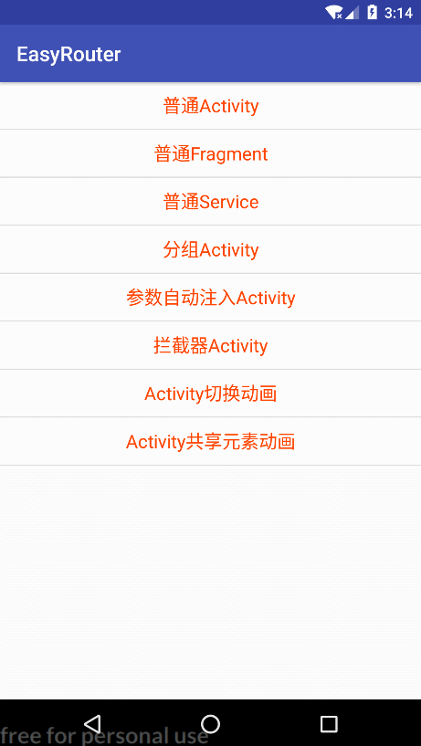

# EasyRouter
  

> `EasyRouter`是专门针对`Android`开发的简易路由框架，使用方便，支持路由分组，功能全面。主要包含三大模块功能：路由转发、自动注入和路由拦截。

### 效果展示

* 效果图：

  

* `Demo`下载：

  

### 基本用法

> 包括路由转发、自动注入和路由拦截。

#### 添加依赖

> 在项目主模块中添加如下依赖

```groovy
dependencies {
  compile 'com.yhy.router:erouter:latestVersion'
  annotationProcessor 'com.yhy.router:erouter-compiler:latestVersion'
}
```

#### 初始化

> 在`Application`中进行初始化

```java
@Override
public void onCreate() {
  super.onCreate();
  
  // 初始化
  ERouter.getInstance().init();
  
  // 如果路由跳转过程中需要传递普通对象的参数，就需要传入Json解析器
  ERouter.getInstance().init(new EJsonParser() {
    Gson gson = new Gson();

    @Override
    public <T> T fromJson(String json, Class<T> clazz) {
      return gson.fromJson(json, clazz);
    }

    @Override
    public <T> String toJson(T obj) {
      return gson.toJson(obj);
    }
  });
  
  // 以上初始化方法二选一
}
```

#### 给需要路由转发的对象注册路由

* 普通路由

  > `Activity`、`Fragment`和`Service`用法都相同

  ```java
  @Router(url = "/activity/normal")
  public class NormalActivity extends BaseActivity {
  }

  @Router(url = "/fragment/normal")
  public class NormalFragment extends BaseFragment {
  }

  @Router(url = "/service/normal")
  public class NormalService extends BaseService {
  }
  ```

* 分组路由

  > 支持路由分组，不指定分组时默认按路由的一级路径分组

  ```java
  @Router(url = "/activity/group", group = "acgp")
  public class GroupActivity extends BaseActivity {
  }
  ```

* 自动注入参数路由

  > 支持参数字段自动注入，包括私有成员
  >
  > 注：如果不手动设置参数名的话，需要保持这里的字段名和设置参数时的参数名相同

  ```java
  @Router(url = "/activity/autowried")
  public class AutowiredActivity extends BaseActivity {
    @Autowired
    public String defParam;
    @Autowired("changed")
    public String chgParam;
    @Autowired
    public User objParam;
    @Autowired
    private String privParam;
    @Autowired
    private User privObjParam;

    // 不自动注入
    private String param;

    private TextView tvDef;
    private TextView tvChg;
    private TextView tvObj;
    private TextView tvPriv;
    private TextView tvPrivObj;

    @Override
    protected int getLayout() {
      return R.layout.activity_autowired;
    }

    @Override
    protected void initView() {
      tvDef = $(R.id.tv_def);
      tvChg = $(R.id.tv_chg);
      tvObj = $(R.id.tv_obj);
      tvPriv = $(R.id.tv_priv);
      tvPrivObj = $(R.id.tv_priv_obj);
    }

    @Override
    protected void initData() {
      tvDef.setText("默认参数：" + defParam);
      tvChg.setText("改变过参数：" + chgParam);
      tvObj.setText("对象参数：" + objParam.toString());
      tvPriv.setText("私有成员参数：" + privParam);
      tvPrivObj.setText("私有对象参数：" + privObjParam.toString());
    }
  }
  ```

#### 路由转发

* 普通路由

  ```java
  ERouter.getInstance()
    .with(MainActivity.this)
    .to("/activity/normal")
    .go();
  ```

* 分组路由

  ```java
  ERouter.getInstance()
    .with(MainActivity.this)
    .to("acgp", "/activity/group")
    .go();
  ```

* 带参自动注入转发

  > 注：如果目标中不手动设置参数名的话，需要保持设置的参数名与目标成员字段名相同

  ```java
  User user = new User("张三", 25, "男");
  User user1 = new User("李四", 33, "女");

  ERouter.getInstance()
    .with(MainActivity.this)
    .to("/activity/autowried")
    .param("defParam", "默认名称参数")
    .param("changed", "修改过名称参数")
    .param("objParam", user)
    .param("privParam", "private参数")
    .param("privObjParam", user1)
    .go();
  ```

* 带拦截器路由转发

  > 路由添加拦截器，执行顺序与设置顺序一致
  >
  > 拦截器名称与`@Interceptor`注解的名称一直，不设置名称时默认使用拦截器类名
  >
  > 如果中间某个拦截器中断了路由，操作将会被中断

  ```java
  // 多个拦截器按设置顺序执行
  ERouter.getInstance()
    .with(MainActivity.this)
    .to(simple.mUrl)
    .interceptor("login")
    .interceptor("LastInterceptor")
    .go();
  ```


#### 定义拦截器

> 实现`EInterceptor`接口，在`execute(EPoster poster)`方法中完成拦截操作
>
> 注：默认返回`false`，表示不中断路由，如需要中断路由操作返回`true`即可

```java
@Interceptor(name = "login")// 不指定名称时拦截器将以类名作为名称
public class LoginInterceptor implements EInterceptor {

  @Override
  public boolean execute(EPoster poster) {
    // 拦截登录状态
    User user = App.getInstance().getUser();
    if (null == user) {
      Toast.makeText(poster.getContext(), "未登录，先去登录", Toast.LENGTH_SHORT).show();

      // 跳转到登录页面
      ERouter.getInstance()
        .with(poster.getContext())
        .to("/activity/login")
        .go();
      
      // 返回true表示中断原本的路由
      return true;
    }

    Toast.makeText(poster.getContext(), "已经登录，往下执行", Toast.LENGTH_SHORT).show();
    // 返回false表示继续往下执行
    return false;
  }
}
```

> `That's all, enjoy yourself !!!`